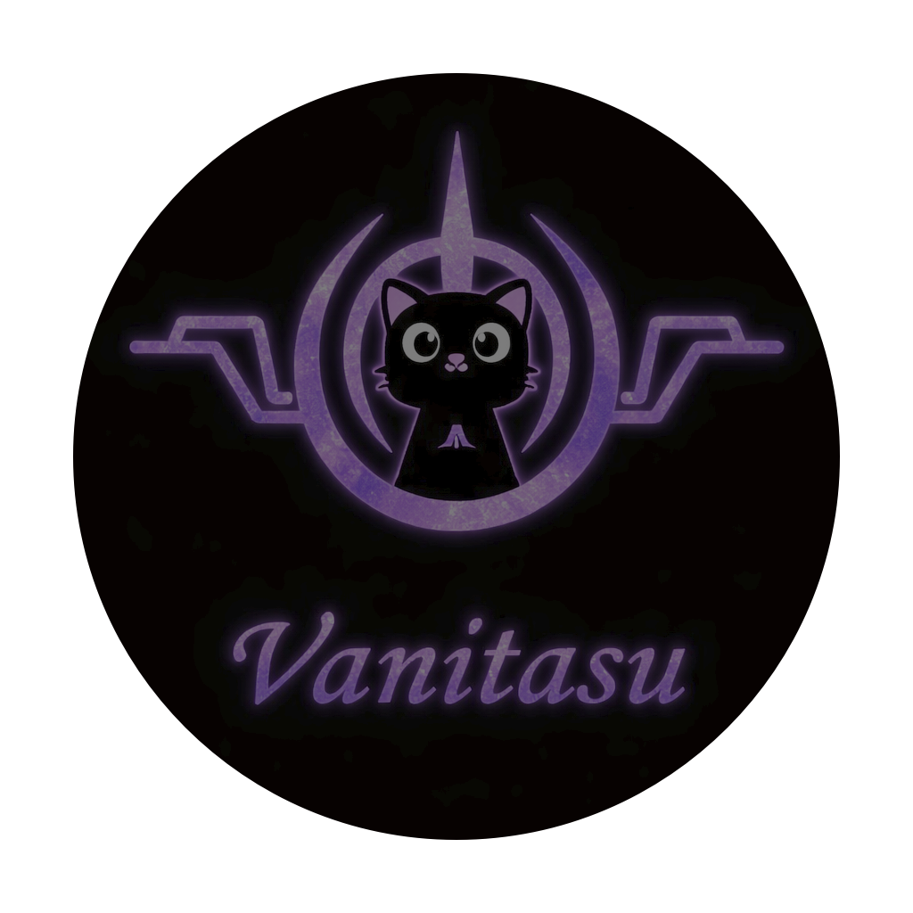

<div align="center">

<a href="https://github.com/VanitasuShieda/Meowrch/tree/Meowrch-vanitasu"></a>

# ≽ܫ≼ Meowrch

# ⚡ Vanitas OS

### *Based on Meowrch. Built for my workflow.*
**Experimental UI. Unified control. Beautiful by design.**

<br>


<br>

<!-- [🚀 Quick Start](#-installation) • [📸 Gallery](#-visual-presentation) • [⚡ Features](#-why-meowrch) • [📖 Wiki](https://meowrch.github.io/en/) • [💬 Community](https://t.me/meowrch) -->

</div>

---


## 🌟 Why Meowrch?

<div align="center">

| Feature | What it gives you |
|:---:|:---|
| **Optimization** | The system has the best optimizations from [ARU](https://github.com/ventureoo/ARU) and [CachyOS](https://cachyos.org/). [More details](https://meowrch.github.io/en/optimization/performance-advantages/) |
| **Community [theme store](https://github.com/meowrch/pawlette-themes)** | Change the appearance of the entire system **with one command** |
| **Open-source development** | We support Linux development by creating our own components, **useful for the global Linux community**. [**More details here**](https://github.com/meowrch/) |
| **Automation** | Installation **in 10 minutes**, complete setup and optimization — **without manual config editing** |
| **Ergonomics** | Hotkeys are thought out **down to the smallest detail** — work faster |
| **Two environments** | BSPWM (X11) or Hyprland (Wayland) — **stability or modernity** |
| **Lightweight** |  **1 GB RAM** at system startup — thanks to [lightweight components](https://meowrch.github.io/en/introduction/сomponent-selection-philosophy/) |
</div>

---
# 🧬 About

This project is my personal fork of Meowrch.

It keeps the performance philosophy and core optimizations,
but replaces the official interface stack with a different vision.

This is not an official build.
This is my workstation.

# 🧪 Why This Exists

Meowrch is powerful.

But I wanted:

* A different interaction layer
* Fewer independent UI daemons
* A more cohesive shell experience
* A design tuned to my personal workflow

So I rebuilt the UI stack around a single core layer.

# 🧠 UI Architecture

Removed:

* ❌ Mewline (for now, dont know the future jet)
* ❌ Waybar
* ❌ Swaync

Replaced with:

* ✅ CaelestiaShell as the central control layer

Panel, launcher, notifications, and system controls flow through one interface philosophy.

Less fragmentation.
More cohesion.
Cleaner debugging.

# 🖥️ Core Stack
| Layer       | Component                 |
| ----------- | ------------------------- |
| Base        | Arch Linux (Optimized)    |
| WM          | Hyprland / BSPWM          |
| UI Layer    | CaelestiaShell            |
| Terminal    | Kitty (Catppuccin tuned)  |
| Shell       | Fish / Zsh                |
| System Info | Fastfetch (custom themed) |

# 🎨 Design Language

* Circuit-inspired branding
* Meowrch cat at the core (homage to origin)
* Dark-first palette
* Terminal-focused workflow
* Smooth animations, minimal clutter

# ⚠️ Disclaimer

This is a personal experimental branch.

It may break.
It may change.
It evolves with my workflow.

If you want the official experience — use Meowrch.

If you want my experiments — welcome.
---

## 🛠️ Installation

> [!WARNING] 
> The installer is designed for **clean Arch Linux**. \
> If you already have a configured system, installation **will overwrite** configurations. \
> For testing, create a new user. \
> If you like it — switch to Meowrch completely

### 📦 Quick Start

```
# 1. Clone the repository
git clone https://github.com/VanitasuShieda/Meowrch/tree/Meowrch-vanitasu --depth 1 --single-branch
cd meowrch

# 2. Run the installer
sh install.sh

# 3. Reboot
reboot
```

---


> [!NOTE]
> **Why these components?**
> We chose between performance, functionality, and stability.
> [More about component selection](https://meowrch.github.io/en/introduction/сomponent-selection-philosophy/)

---

## ⌨️ Hotkeys

| Action                | Combination    | Why is it convenient?                                                                               |
| --------------------- | -------------- | --------------------------------------------------------------------------------------------------- |
| Open terminal         | Super + Enter  | Quick access to a universal tool.                                                                   |
| Application selection | Super + A      | Convenient way to select the needed application.                                                    |
| Color picker          | Super + C      | Recognize color from screen for design/development.                                                 |
| Change wallpaper      | Super + W      | Rofi with preview. One button — new desktop look.                                                   |
| Change theme          | Super + T      | New theme in 2 seconds. Without editing configs.                                                    |
| Emoji                 | Super + .      | Like in Windows 11, but faster.                                                                     |
| Disable hotkeys       | Super + Escape | Can help when using virtual machines on Meowrch with configurations that also work through hotkeys. |


> [!TIP]
> **All available hotkeys** can be found [**here**](https://meowrch.github.io/en/usage/hotkeys/#meowrch-hotkeys).
> **Show available hotkeys in System**  Super +  /  


---

## 💬 Support and Community

<div align="center">

<a href="https://meowrch.github.io/">

</a>

**[🌐 Official Wiki of Meowrch](https://meowrch.github.io/)** — guides, FAQ, troubleshooting

<br>

### 💬 Join the Community

<table align="center">
<tr>
<td align="center" width="33%">
<h3>📢 Telegram</h3>
<a href="https://t.me/meowrch">

</a>
<br><br>
News, updates and <a href="https://t.me/meowrch/7">quick support</a>
</td>
<td align="center" width="33%">
<h3>🐛 Issues</h3>
<a href="https://github.com/meowrch/meowrch/issues">

</a>
<br><br>
Report a bug or suggest a feature
</td>
<td align="center" width="33%">
<h3>⭐ Reviews</h3>
<a href="https://meowrch.github.io/en/#reviews">

</a>
<br><br>
Share your impressions about the distribution
</td>
</tr>
</table>

</div>

---

## ⭐ What Users Say?

<div align="center">

<a href="https://meowrch.github.io/en/#reviews">

</a>
<br>
<br>
</div>


> [!IMPORTANT] 
> **📢 Your review matters!** \
>  Share your experience on **[website](https://meowrch.github.io/en/#reviews)**

---

## ☕ Support the Original Meowrch Project

<div align="center">

| 💎 Cryptocurrency | 📬 Address |
|:---:|:---|
| **TON** | `UQB9qNTcAazAbFoeobeDPMML9MG73DUCAFTpVanQnLk3BHg3` |
| **Ethereum** | `0x56e8bf8Ec07b6F2d6aEdA7Bd8814DB5A72164b13` |
| **Bitcoin** | `bc1qt5urnw7esunf0v7e9az0jhatxrdd0smem98gdn` |
| **Tron** | `TBTZ5RRMfGQQ8Vpf8i5N8DZhNxSum2rzAs` |

</div>

---

## 📊 Project Statistics

<a href="https://star-history.com/#meowrch/meowrch&Date">
<picture>
<source media="(prefers-color-scheme: dark)" srcset="https://api.star-history.com/svg?repos=meowrch/meowrch&type=Date&theme=dark" />
<source media="(prefers-color-scheme: light)" srcset="https://api.star-history.com/svg?repos=meowrch/meowrch&type=Date" />

</picture>
</a>

---

<div align="center">

**Made with ❤️ for the Linux community**

</div>
